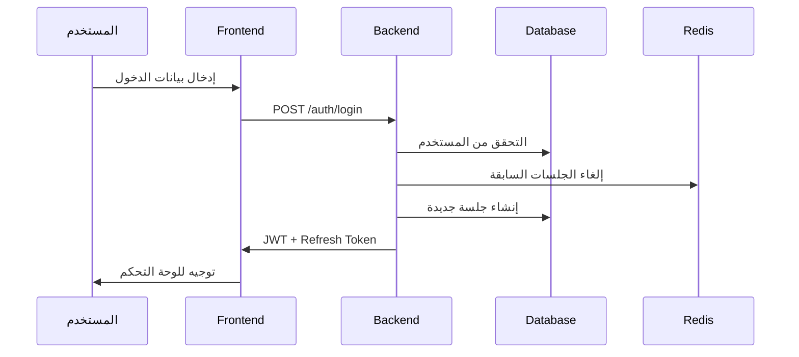
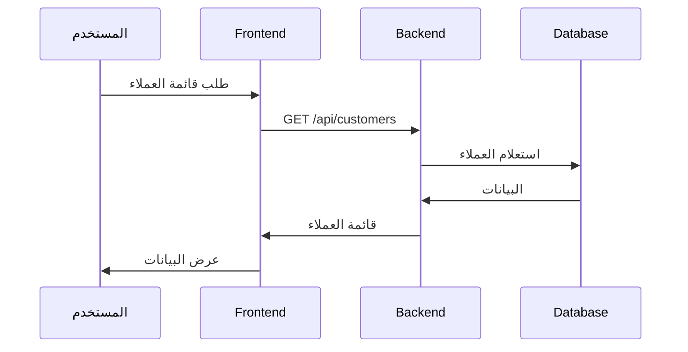
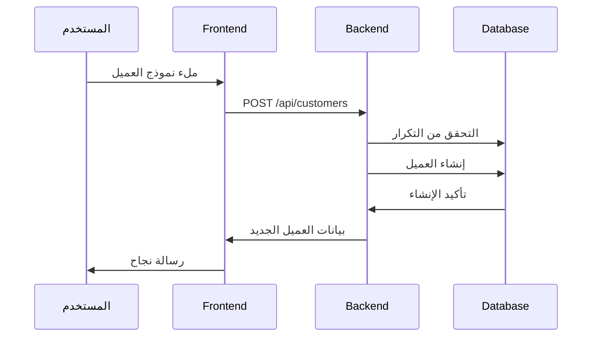

# سير العمل - ELKHAWAGA ERP

## سير العمل الرئيسي

### 1. تسجيل الدخول

### 2. إدارة العملاء

### 3. إنشاء عميل جديد

## سير العمل الإداري

### 1. إدارة الأدوار والصلاحيات
1. إنشاء دور جديد
2. تحديد الموديولات المطلوبة
3. إضافة الصلاحيات تلقائياً
4. تعيين الدور للمستخدمين

### 2. تفعيل/تعطيل الموديولات
1. الوصول لإعدادات النظام
2. تحديد الموديولات المطلوبة
3. حفظ الإعدادات
4. تطبيق التغييرات فوراً

### 3. إدارة الثيمات
1. اختيار الثيم المطلوب
2. حفظ التفضيلات
3. تطبيق الثيم على الواجهة

## سير العمل التقني

### 1. نشر التحديثات
1. اختبار التحديثات محلياً
2. رفع الكود للمستودع
3. تشغيل الاختبارات التلقائية
4. النشر على الخادم

### 2. النسخ الاحتياطي
1. نسخ احتياطي لقاعدة البيانات
2. نسخ احتياطي للملفات
3. التحقق من سلامة النسخ
4. تخزين النسخ في مكان آمن

### 3. مراقبة الأداء
1. مراقبة استجابة الخادم
2. مراقبة استخدام قاعدة البيانات
3. مراقبة استخدام الذاكرة
4. تسجيل الأخطاء والتحذيرات 